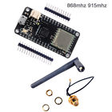
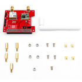
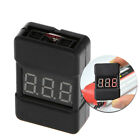
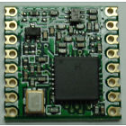
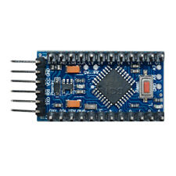
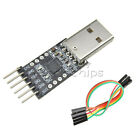
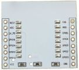

# LoRaWAN Study

# Bill of Material

Image | Name | Cost | PO Date | Comments
------|-----|------|---------|----------
 | [LoRa32u4 II 868 915Mhz SX1276 Lora Module IOT Development Board+U.FL Antenna][LoRa32u4]| $16.45 | [2018/10/17][PO20181017] | 
 | [wireless 433/868/915Mhz Lora and GPS Expansion Board for Raspberry Pi][LoRa Hat 4 RPi]|$27.70 | 2018/10/17
 | [BX100 1-8S Lipo Battery Low Voltage Power Display Tester Buzzer Alarm][LiPoMeter] - Cancelled | $1.89 | [2017/01/28][PO20170128] |
 | [HopeRF RFM95W 915Mhz, LoRa Ultra Long Range Transceiver, SX1276 compatible][RFM95W] | $17.80 ($6.4 each 2019/06/10) | [2017/01/26 - missing link!][PO20170126] | [RFM95](https://www.hoperf.com/modules/lora/RFM95.html)
 | [5Pcs Mini ATMEAG328 3.3V 8Mhz Replace ATmega128 For Arduino Pro Mini Compatible][ATMEAG328-3.3v] | $8.54 | 2017/01/26
 | [USB 2.0 to TTL UART CP2102 Module 6Pin Serial Converter Free Cables][USB-UART] | $2.19 | 2017/01/26 | 
 | [ESP8266’s adapter plate](https://www.aliexpress.com/item/10-x-ESP8266-WiFi-Module-Breakout-Board-Adapter-Plate-for-ESP-07-for-ESP-08-for/32860694356.html?spm=2114.search0104.3.44.40ca3164L5TZny&ws_ab_test=searchweb0_0,searchweb201602_3_10065_10130_10068_10890_10547_319_10546_317_10548_10545_10696_453_10084_454_10083_10618_10307_537_536_10059_10884_10887_321_322_10103,searchweb201603_53,ppcSwitch_0&algo_expid=6f3c30c2-e733-425d-a147-dc99b15f5024-6&algo_pvid=6f3c30c2-e733-425d-a147-dc99b15f5024&transAbTest=ae803_5) | $0.20 | ToDo

[PO20181017]:(https://vod.ebay.com/vod/FetchOrderDetails?_trksid=p2057872.m2749.l2673&itemid=272918540854&transid=2060843997017)

[PO20170128]:(https://vod.ebay.com/vod/FetchOrderDetails?_trksid=p2057872.m2749.l2673&itemid=122258059231&transid=1743707776002)

[PO20170126]:(https://vod.ebay.com/vod/FetchOrderDetails?_trksid=p2057872.m2749.l2673&itemid=181442612615&transid=1611375330008)

[PO20170126]:(https://vod.ebay.com/vod/FetchOrderDetails?_trksid=p2057872.m2749.l2673&itemid=322045000800&transid=1705901439011)

[LoRa32u4]:(https://www.ebay.com/itm/272918540854)

[LoRa Hat 4 RPi]:(https://www.ebay.com/itm/123112711433)

[RFM95W]:(https://www.ebay.com/itm/HopeRF-RFM95W-915Mhz-LoRa-Ultra-Long-Range-Transceiver-SX1276-compatible-/181442612615?hash=item2a3ed28d87)

[LiPoMeter]:(https://www.ebay.com/itm/BX100-1-8S-Lipo-Battery-Low-Voltage-Power-Display-Tester-Buzzer-Alarm-/122258059231?hash=item1c7725efdf)

[ATMEAG328-3.3v]:(https://www.ebay.com/itm/5Pcs-Mini-ATMEAG328-3-3V-8Mhz-Replace-ATmega128-For-Arduino-Pro-Mini-Compatible-/222050323175?hash=item33b33b0ae7)

[USB-UART]:(https://www.ebay.com/itm/USB-2-0-to-TTL-UART-CP2102-Module-6Pin-Serial-Converter-Free-Cables-/322045000800?hash=item4afb60bc60)

References:

1. [HopeRF RFM95 and arduino a low cost LoRaWan solution](https://www.disk91.com/2019/technology/lora/hoperf-rfm95-and-arduino-a-low-cost-lorawan-solution/)